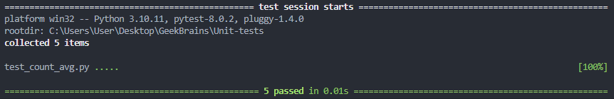

## Задание 1.

Создайте программу на Python или Java, которая принимает два списка чисел и выполняет следующие действия:

- Рассчитывает среднее значение каждого списка.
- Сравнивает эти средние значения и выводит соответствующее сообщение:
  - ""Первый список имеет большее среднее значение"", если среднее значение первого списка больше.
  - ""Второй список имеет большее среднее значение"", если среднее значение второго списка больше.
  - ""Средние значения равны"", если средние значения списков равны.
    
